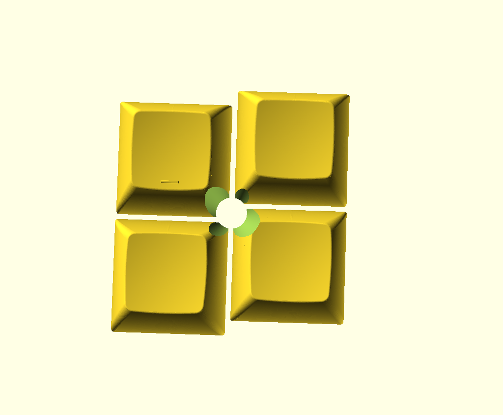

# [WIP] Trackpoint Keycap Generator

An OpenSCAD library for generating 3D models of keycaps with cutouts for use with trackpoint-style pointing sticks. Customizable for different keycap profiles and trackpoint positions.

Currently in the proof-of-concept phase, so not particularly usable yet.

## Additional Images
OpenSCAD output for the example keycaps

